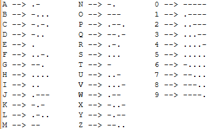

# CLI Morse to Text

## Descrição Técnica

O projeto **Morse to Text** é uma aplicação CLI escrita em Go que traduz códigos Morse para texto.  
O código Morse não diferencia maiúsculas de minúsculas, tradicionalmente letras maiúsculas são usadas para representação.  
Quando a mensagem é escrita em
código Morse, um único espaço é usado para separar os códigos dos caracteres e 3 espaços são usados para separar palavras.  
```
Por Exemplo:
".... . -.--   .--- ..- -.. .." traduzido é HEY JUDI
```
#### Alfabeto e os respectivos códigos Morse




## Instruções para Rodar o Programa

### Pré-requisitos

- Sistema operacional Linux 
- Go instalado (versão 1.25 ou superior).

### Passos

1. Clone o repositório:
   ```bash
   git clone https://github.com/valdinei-santos/morse-to-text.git
   cd morse-to-text
   ```

2. Compile o programa:
   ```bash
   make build
   ```
   Saída:
   ```bash
   Build completo: morse-to-text gerado
   ```

3. Execute o programa passando um código Morse como argumento:
   ```bash
   ./morse-to-text "--- .."
   ```

   Saída:
   ```bash
   Código morse: --- ..
   Tradução....: OI
   ```


## Instruções para Rodar os Testes

### Passos

1. Navegue até o diretório do projeto:
   ```bash
   cd morse-to-text
   ```

2. Execute todos os testes:
   ```bash
   make test
   ```

   Exemplo de saída:
   ```bash
   ok      github.com/valdinei-santos/morse-to-text/cmd/morse-to-text      0.024s
   ok      github.com/valdinei-santos/morse-to-text/internal/checkarguments        0.028s
   ok      github.com/valdinei-santos/morse-to-text/internal/database      0.023s
   ok      github.com/valdinei-santos/morse-to-text/internal/translator    0.023s
   ```

3. Para rodar um teste específico, use o comando **go test**, conforme abaixo:
   ```bash
   go test -run TestNomeDoTeste ./caminho/do/pacote

   Por exemplo:
     go test -run TestGetArguments_WithValidArgument ./internal/checkarguments
   ```

4. Para ver a cobertura dos testes na aplicação:
   ```bash
   make cover
   ``` 


### Estrutura de Testes
O projeto inclui testes automatizados para os seguintes componentes:

- **checkarguments**: Valida os argumentos de entrada.
- **database**: Testa a construção da base de dados e a recuperação de letras.
- **translator**: Testa a tradução de códigos Morse, incluindo casos de sucesso e erro.
- **main**: Testa o fluxo completo do programa, incluindo cenários de sucesso e falha.


## Detalhes de Implementação

### Estrutura do Projeto

- **cmd/morse-to-text**: Contém o ponto de entrada principal do programa (`main.go`).
- **internal/checkarguments**: Gerencia a validação e o processamento dos argumentos de entrada.
- **internal/database**: Contém a base de dados de tradução de código Morse para texto.
- **internal/translator**: Implementa a lógica de tradução de código Morse para texto.
- **images**: Contém as imagens usadas na documentação do projeto.

### Fluxo de Execução

1. O programa recebe um código Morse como argumento via linha de comando.
2. O pacote `checkarguments` valida os argumentos fornecidos.
3. O pacote `database` inicializa a base de dados de tradução.
4. O pacote `translator` realiza a tradução do código Morse para texto.
5. O resultado é exibido no terminal.


## Autor

Este projeto foi desenvolvido por:

*   [Valdinei Valmir dos Santos](https://github.com/valdinei-santos)
